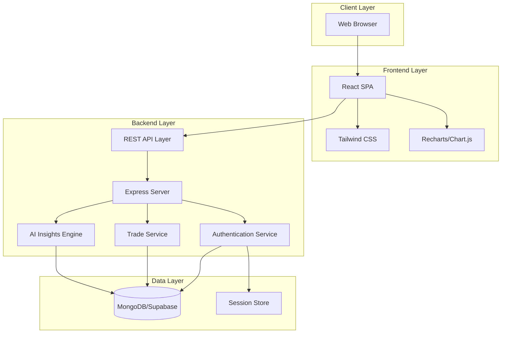
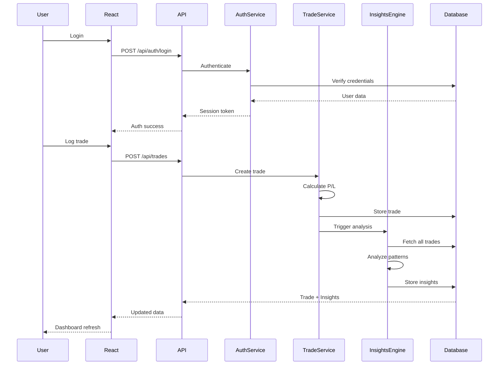

# Design Document: MindfulTrader

## Overview

MindfulTrader is an AI-powered psychological trading journal web application that helps traders correlate their emotional states with trading performance. The system consists of a React-based frontend, Node.js/Express backend, and MongoDB/Supabase database, providing trade logging, analytics, visualization, and AI-driven insights.

### Core Capabilities

1. **User Authentication**: Secure signup/login with session management
2. **Trade Management**: Log trades with emotional context (mood, notes)
3. **Analytics Dashboard**: View recent trades, filter by mood/asset, see performance metrics
4. **AI Insights**: Pattern recognition correlating mood states with profitability
5. **Data Visualization**: Charts showing performance by mood and over time
6. **Responsive UI**: Clean, minimal interface working across devices

### Key Design Decisions

- **Monolithic Architecture**: Single Node.js backend with React SPA frontend for MVP simplicity
- **RESTful API**: Standard REST endpoints for clear client-server communication
- **Session-Based Auth**: Cookie-based sessions for simplicity (can migrate to JWT later)
- **Modular Frontend**: Component-based React architecture for maintainability
- **Extensible AI Engine**: Pluggable design allowing future ML model integration
- **Database Flexibility**: Abstract data layer supporting MongoDB or Supabase

## Architecture

### System Architecture



### Component Interaction Flow



## Components and Interfaces

### Frontend Components

#### 1. Authentication Components

**LoginForm**
- Purpose: User login interface
- Props: `onLoginSuccess: () => void`
- State: `email: string, password: string, error: string, loading: boolean`
- Methods:
  - `handleSubmit()`: Validates input and calls login API
  - `handleInputChange()`: Updates form state

**SignupForm**
- Purpose: User registration interface
- Props: `onSignupSuccess: () => void`
- State: `email: string, password: string, confirmPassword: string, error: string, loading: boolean`
- Methods:
  - `handleSubmit()`: Validates input and calls signup API
  - `validatePassword()`: Checks password strength

#### 2. Trade Management Components

**TradeForm**
- Purpose: Log new trades
- Props: `onTradeCreated: (trade: Trade) => void`
- State: `asset: string, entryPrice: number, exitPrice: number, tradeType: 'long' | 'short', mood: Mood, notes: string, error: string, loading: boolean`
- Methods:
  - `handleSubmit()`: Validates and submits trade
  - `calculateProfitLoss()`: Computes P/L preview
  - `validatePrices()`: Ensures positive numbers

**TradeList**
- Purpose: Display recent trades
- Props: `trades: Trade[], onFilterChange: (filter: Filter) => void`
- State: `selectedMood: Mood | null, selectedAsset: string | null`
- Methods:
  - `renderTrade()`: Formats individual trade display
  - `applyFilters()`: Filters trade list

#### 3. Dashboard Components

**Dashboard**
- Purpose: Main application view
- Props: None (fetches own data)
- State: `trades: Trade[], insights: Insight[], loading: boolean, error: string`
- Methods:
  - `fetchDashboardData()`: Loads trades and insights
  - `handleTradeCreated()`: Refreshes data after new trade

**MetricsSummary**
- Purpose: Display aggregate statistics
- Props: `trades: Trade[]`
- Computed:
  - `totalProfitLoss: number`
  - `tradeCount: number`
  - `winRate: number`

#### 4. Visualization Components

**MoodPerformanceChart**
- Purpose: Bar chart of P/L by mood
- Props: `trades: Trade[]`
- Methods:
  - `aggregateByMood()`: Groups trades by mood and sums P/L
  - `formatChartData()`: Transforms data for charting library

**PerformanceTrendChart**
- Purpose: Time-series line chart
- Props: `trades: Trade[]`
- Methods:
  - `calculateCumulativePL()`: Computes running total
  - `formatTimeSeriesData()`: Prepares data for chart

**InsightsPanel**
- Purpose: Display AI-generated insights
- Props: `insights: Insight[], tradeCount: number`
- Methods:
  - `renderInsight()`: Formats insight text
  - `renderInsufficientDataMessage()`: Shows when < 10 trades

### Backend Services

#### 1. Authentication Service

**Interface:**
```typescript
interface AuthService {
  signup(email: string, password: string): Promise<User>
  login(email: string, password: string): Promise<Session>
  logout(sessionId: string): Promise<void>
  validateSession(sessionId: string): Promise<User | null>
  hashPassword(password: string): Promise<string>
  verifyPassword(password: string, hash: string): Promise<boolean>
}
```

**Responsibilities:**
- User registration with email/password validation
- Password hashing using bcrypt
- Session creation and management
- Authentication middleware for protected routes

#### 2. Trade Service

**Interface:**
```typescript
interface TradeService {
  createTrade(userId: string, tradeData: TradeInput): Promise<Trade>
  getTrades(userId: string, filters?: TradeFilters): Promise<Trade[]>
  getTradeById(userId: string, tradeId: string): Promise<Trade | null>
  calculateProfitLoss(entryPrice: number, exitPrice: number, tradeType: TradeType): number
  validateTradeInput(tradeData: TradeInput): ValidationResult
}
```

**Responsibilities:**
- Trade CRUD operations
- Profit/Loss calculation logic
- Input validation (positive prices, required fields)
- Trade filtering by mood, asset, date range

#### 3. AI Insights Engine

**Interface:**
```typescript
interface InsightsEngine {
  generateInsights(userId: string): Promise<Insight[]>
  analyzeMoodCorrelation(trades: Trade[]): MoodCorrelation[]
  identifyPatterns(trades: Trade[]): Pattern[]
  formatInsightText(correlation: MoodCorrelation): string
  shouldGenerateInsights(tradeCount: number): boolean
}
```

**Responsibilities:**
- Analyze mood-to-profitability correlations
- Generate natural language insights
- Identify positive and negative mood patterns
- Determine when sufficient data exists (≥10 trades)

**Algorithm Overview:**
1. Group trades by mood
2. Calculate aggregate P/L per mood
3. Calculate average P/L per mood
4. Rank moods by profitability
5. Generate insight text for top/bottom performers

### API Endpoints

#### Authentication Endpoints

**POST /api/auth/signup**
- Request: `{ email: string, password: string }`
- Response: `{ user: { id: string, email: string }, message: string }`
- Status Codes: 201 (Created), 400 (Invalid input), 409 (Email exists)

**POST /api/auth/login**
- Request: `{ email: string, password: string }`
- Response: `{ user: { id: string, email: string }, sessionId: string }`
- Status Codes: 200 (OK), 401 (Invalid credentials)

**POST /api/auth/logout**
- Request: None (session from cookie)
- Response: `{ message: string }`
- Status Codes: 200 (OK)

#### Trade Endpoints

**POST /api/trades**
- Auth: Required
- Request: `{ asset: string, entryPrice: number, exitPrice: number, tradeType: 'long' | 'short', mood: Mood, notes?: string }`
- Response: `{ trade: Trade, message: string }`
- Status Codes: 201 (Created), 400 (Validation error), 401 (Unauthorized)

**GET /api/trades**
- Auth: Required
- Query Params: `mood?: Mood, asset?: string, limit?: number`
- Response: `{ trades: Trade[], count: number }`
- Status Codes: 200 (OK), 401 (Unauthorized)

#### Insights Endpoint

**GET /api/insights**
- Auth: Required
- Response: `{ insights: Insight[], tradeCount: number, hasMinimumData: boolean }`
- Status Codes: 200 (OK), 401 (Unauthorized)

## Data Models

### User Model

```typescript
interface User {
  id: string                    // UUID
  email: string                 // Unique, validated email
  passwordHash: string          // Bcrypt hashed password
  createdAt: Date              // Account creation timestamp
  updatedAt: Date              // Last modification timestamp
}
```

**Constraints:**
- `email`: Unique index, valid email format
- `passwordHash`: Minimum 60 characters (bcrypt output)

### Trade Model

```typescript
interface Trade {
  id: string                    // UUID
  userId: string                // Foreign key to User
  asset: string                 // Asset symbol/name
  entryPrice: number            // Must be positive
  exitPrice: number             // Must be positive
  tradeType: 'long' | 'short'   // Trade direction
  mood: Mood                    // Emotional state
  notes?: string                // Optional, max 500 chars
  profitLoss: number            // Calculated field
  timestamp: Date               // Trade log time
  createdAt: Date              // Record creation time
}

type Mood = 'Calm' | 'Anxious' | 'Greedy' | 'Disciplined' | 'Fearful'
```

**Constraints:**
- `userId`: Indexed for query performance
- `entryPrice`, `exitPrice`: Positive numbers only
- `mood`: Enum restricted to 5 values
- `notes`: Max 500 characters
- `timestamp`: Indexed for time-series queries

**Profit/Loss Calculation:**
```typescript
// For Long trades
profitLoss = exitPrice - entryPrice

// For Short trades
profitLoss = entryPrice - exitPrice
```

### Session Model

```typescript
interface Session {
  id: string                    // Session ID
  userId: string                // Foreign key to User
  expiresAt: Date              // Session expiration
  createdAt: Date              // Session creation time
}
```

**Constraints:**
- `id`: Unique session identifier (stored in cookie)
- `expiresAt`: Indexed for cleanup queries
- Sessions expire after 7 days of inactivity

### Insight Model

```typescript
interface Insight {
  id: string                    // UUID
  userId: string                // Foreign key to User
  text: string                  // Natural language insight
  moodAnalysis: MoodCorrelation[] // Supporting data
  generatedAt: Date            // Insight generation time
}

interface MoodCorrelation {
  mood: Mood
  totalProfitLoss: number
  averageProfitLoss: number
  tradeCount: number
  rank: number                  // 1 = best, 5 = worst
}
```

**Constraints:**
- `userId`: Indexed for query performance
- Insights regenerated on each new trade (for MVP)
- Future: Cache insights and regenerate periodically

## Error Handling

### Error Categories

#### 1. Validation Errors (400 Bad Request)

**Scenarios:**
- Missing required fields in trade/auth forms
- Invalid email format
- Negative or zero prices
- Invalid mood value
- Notes exceeding 500 characters

**Response Format:**
```typescript
{
  error: "Validation Error",
  message: "Descriptive error message",
  fields: {
    fieldName: "Specific field error"
  }
}
```

**Frontend Handling:**
- Display field-specific errors inline
- Highlight invalid fields in red
- Prevent form submission until valid

#### 2. Authentication Errors (401 Unauthorized)

**Scenarios:**
- Invalid login credentials
- Expired session
- Missing session cookie
- Accessing protected endpoint without auth

**Response Format:**
```typescript
{
  error: "Authentication Error",
  message: "Invalid credentials" | "Session expired"
}
```

**Frontend Handling:**
- Redirect to login page
- Clear local session state
- Display error message on login form

#### 3. Resource Errors (404 Not Found)

**Scenarios:**
- Trade ID not found
- User not found
- Invalid API endpoint

**Response Format:**
```typescript
{
  error: "Not Found",
  message: "Resource description not found"
}
```

**Frontend Handling:**
- Display user-friendly "not found" message
- Redirect to dashboard or appropriate page

#### 4. Server Errors (500 Internal Server Error)

**Scenarios:**
- Database connection failure
- Unexpected exceptions
- AI insights generation failure

**Response Format:**
```typescript
{
  error: "Internal Server Error",
  message: "An unexpected error occurred. Please try again."
}
```

**Frontend Handling:**
- Display generic error message
- Provide retry button
- Log error details for debugging

**Backend Logging:**
- Log full error stack trace
- Include request context (user ID, endpoint, timestamp)
- Alert on repeated failures

#### 5. Database Errors

**Scenarios:**
- Connection timeout
- Query failure
- Constraint violation

**Handling Strategy:**
- Wrap all database operations in try-catch
- Return appropriate HTTP status codes
- Log errors with context
- Graceful degradation where possible

**Example:**
```typescript
try {
  const trades = await db.trades.find({ userId })
  return res.json({ trades })
} catch (error) {
  logger.error('Database query failed', { userId, error })
  return res.status(500).json({
    error: 'Database Error',
    message: 'Unable to retrieve trades. Please try again.'
  })
}
```

### Error Logging Strategy

**Backend:**
- Use structured logging (Winston or Pino)
- Log levels: ERROR, WARN, INFO, DEBUG
- Include context: userId, endpoint, timestamp, stack trace
- Separate log files for errors vs general logs

**Frontend:**
- Log errors to console in development
- Send critical errors to backend logging endpoint (future)
- Include user context and component stack

## Testing Strategy

### Testing Approach

MindfulTrader uses a **multi-layered testing strategy** combining unit tests, integration tests, and end-to-end tests. Property-based testing is **not applicable** for this application because:

- **Primary focus is UI rendering and user interactions** (React components, forms, dashboards)
- **CRUD operations dominate the backend** (database reads/writes with minimal transformation logic)
- **External dependencies** (database, session store, charting libraries) are better tested with integration tests
- **Simple algorithmic logic** (P/L calculation, basic correlation analysis) is adequately covered by example-based unit tests

Instead, we use:
- **Unit tests** for isolated logic (calculations, validation, formatting)
- **Integration tests** for API endpoints and database interactions
- **Component tests** for React UI behavior
- **E2E tests** for critical user workflows

### Unit Testing

**Backend Unit Tests (Jest + Node.js)**

**Trade Service Tests:**
- ✓ `calculateProfitLoss()` with long trades (positive and negative outcomes)
- ✓ `calculateProfitLoss()` with short trades (positive and negative outcomes)
- ✓ `validateTradeInput()` with valid data
- ✓ `validateTradeInput()` with missing required fields
- ✓ `validateTradeInput()` with negative prices
- ✓ `validateTradeInput()` with invalid mood values
- ✓ `validateTradeInput()` with notes exceeding 500 characters

**AI Insights Engine Tests:**
- ✓ `analyzeMoodCorrelation()` with 10+ trades across all moods
- ✓ `analyzeMoodCorrelation()` with trades in only 2-3 moods
- ✓ `identifyPatterns()` identifies best performing mood
- ✓ `identifyPatterns()` identifies worst performing mood
- ✓ `formatInsightText()` generates readable natural language
- ✓ `shouldGenerateInsights()` returns false when < 10 trades
- ✓ `shouldGenerateInsights()` returns true when ≥ 10 trades

**Authentication Service Tests:**
- ✓ `hashPassword()` produces valid bcrypt hash
- ✓ `verifyPassword()` correctly validates matching password
- ✓ `verifyPassword()` rejects non-matching password
- ✓ Email validation accepts valid formats
- ✓ Email validation rejects invalid formats

**Frontend Unit Tests (Jest + React Testing Library)**

**Component Tests:**
- ✓ `TradeForm` validates required fields before submission
- ✓ `TradeForm` displays P/L preview as user types prices
- ✓ `TradeForm` shows error messages for invalid input
- ✓ `TradeList` filters trades by selected mood
- ✓ `TradeList` filters trades by selected asset
- ✓ `MetricsSummary` calculates total P/L correctly
- ✓ `MetricsSummary` calculates win rate correctly
- ✓ `InsightsPanel` shows insufficient data message when < 10 trades
- ✓ `InsightsPanel` displays insights when ≥ 10 trades
- ✓ `MoodPerformanceChart` aggregates P/L by mood correctly
- ✓ `PerformanceTrendChart` calculates cumulative P/L correctly

**Utility Function Tests:**
- ✓ Date formatting functions
- ✓ Currency formatting functions
- ✓ Form validation helpers

### Integration Testing

**API Integration Tests (Supertest + Jest)**

**Authentication Flow:**
- ✓ POST /api/auth/signup creates new user with valid data
- ✓ POST /api/auth/signup returns 409 for duplicate email
- ✓ POST /api/auth/signup returns 400 for invalid email
- ✓ POST /api/auth/login returns session for valid credentials
- ✓ POST /api/auth/login returns 401 for invalid credentials
- ✓ POST /api/auth/logout terminates session
- ✓ Session persists across requests
- ✓ Expired sessions are rejected

**Trade Management Flow:**
- ✓ POST /api/trades creates trade with valid data
- ✓ POST /api/trades returns 401 without authentication
- ✓ POST /api/trades returns 400 for missing required fields
- ✓ POST /api/trades calculates P/L correctly
- ✓ GET /api/trades returns user's trades only
- ✓ GET /api/trades filters by mood parameter
- ✓ GET /api/trades filters by asset parameter
- ✓ GET /api/trades limits results to 10 by default

**Insights Flow:**
- ✓ GET /api/insights returns empty with < 10 trades
- ✓ GET /api/insights generates insights with ≥ 10 trades
- ✓ GET /api/insights returns 401 without authentication
- ✓ Insights update after new trade is created

**Database Integration:**
- ✓ User creation persists to database
- ✓ Trade creation persists to database
- ✓ Queries return correct user-specific data
- ✓ Database constraints prevent invalid data
- ✓ Transactions rollback on error

### End-to-End Testing

**E2E Tests (Playwright or Cypress)**

**Critical User Workflows:**

**1. New User Signup and First Trade:**
- ✓ User navigates to signup page
- ✓ User enters email and password
- ✓ User is redirected to dashboard after signup
- ✓ Dashboard shows empty state
- ✓ User clicks "Log Trade" button
- ✓ User fills trade form with all fields
- ✓ User submits trade
- ✓ Dashboard updates with new trade
- ✓ Insufficient data message shown for insights

**2. Returning User Login and Trade Logging:**
- ✓ User navigates to login page
- ✓ User enters credentials
- ✓ User is redirected to dashboard
- ✓ Dashboard shows previous trades
- ✓ User logs multiple trades
- ✓ Dashboard updates in real-time

**3. Dashboard Filtering and Visualization:**
- ✓ User selects mood filter
- ✓ Trade list updates to show only selected mood
- ✓ User selects asset filter
- ✓ Trade list updates to show only selected asset
- ✓ Charts display correctly
- ✓ Charts update when filters change

**4. AI Insights Generation:**
- ✓ User logs 10th trade
- ✓ Insights panel updates automatically
- ✓ Insights display mood correlations
- ✓ Insights identify best/worst moods

**5. Responsive Design:**
- ✓ Application loads on mobile viewport (375px)
- ✓ Forms are usable on mobile
- ✓ Charts render correctly on mobile
- ✓ Navigation works on mobile

**6. Error Handling:**
- ✓ Invalid login shows error message
- ✓ Form validation prevents invalid submission
- ✓ Network errors display user-friendly messages
- ✓ Session expiration redirects to login

### Test Data Strategy

**Unit Tests:**
- Use hardcoded test data
- Mock external dependencies (database, APIs)
- Focus on logic correctness

**Integration Tests:**
- Use test database (separate from development)
- Seed database with known test data
- Clean up after each test

**E2E Tests:**
- Use isolated test environment
- Reset database before each test suite
- Use factory functions for test data generation

### Test Coverage Goals

- **Backend**: 80% code coverage minimum
- **Frontend**: 70% code coverage minimum
- **Critical paths**: 100% coverage (auth, trade creation, P/L calculation)

### Continuous Testing

- Run unit tests on every commit (pre-commit hook)
- Run integration tests on pull requests
- Run E2E tests nightly and before releases
- Monitor test execution time (keep under 5 minutes for unit/integration)

## Implementation Notes

### Technology Stack Decisions

**Frontend:**
- **React 18+**: Modern hooks-based components, concurrent rendering
- **Tailwind CSS**: Utility-first styling for rapid UI development
- **Recharts**: Declarative charting library with good React integration
- **Axios**: HTTP client for API calls with interceptors for auth

**Backend:**
- **Node.js 18+ LTS**: Stable, mature runtime
- **Express 4.x**: Minimal, flexible web framework
- **Bcrypt**: Industry-standard password hashing
- **Express-session**: Session management middleware
- **Joi or Zod**: Schema validation for API inputs

**Database:**
- **MongoDB** (recommended for MVP): Flexible schema, easy setup, good for rapid iteration
- **Supabase** (alternative): Managed PostgreSQL with built-in auth (can simplify auth implementation)

**Development Tools:**
- **TypeScript**: Type safety across frontend and backend
- **ESLint + Prettier**: Code quality and formatting
- **Jest**: Testing framework
- **Supertest**: API testing
- **Playwright**: E2E testing

### Security Considerations

**Authentication:**
- Password minimum length: 8 characters
- Bcrypt rounds: 10 (balance security and performance)
- Session expiration: 7 days
- HTTP-only cookies for session storage
- CSRF protection for state-changing operations

**Input Validation:**
- Validate all inputs on both client and server
- Sanitize user-generated content (notes field)
- Use parameterized queries to prevent SQL injection (if using Supabase)
- Validate numeric inputs are within reasonable ranges

**API Security:**
- Rate limiting on auth endpoints (prevent brute force)
- CORS configuration for production
- HTTPS only in production
- Helmet.js for security headers

### Performance Considerations

**Database Optimization:**
- Index on `userId` for trades table
- Index on `timestamp` for time-series queries
- Limit default query results (10 trades on dashboard)
- Consider pagination for large trade histories (future)

**Frontend Optimization:**
- Lazy load chart components
- Debounce filter inputs
- Memoize expensive calculations (cumulative P/L)
- Use React.memo for pure components

**API Optimization:**
- Cache insights (regenerate only on new trade)
- Batch database queries where possible
- Use connection pooling for database

### Deployment Architecture

**MVP Deployment:**
- Single server deployment (e.g., Heroku, Railway, Render)
- Frontend served as static files from Express
- Database hosted on MongoDB Atlas or Supabase cloud

**Future Scalability:**
- Separate frontend and backend deployments
- CDN for static assets
- Load balancer for multiple backend instances
- Redis for session store (replace in-memory sessions)
- Background job queue for insights generation

### Environment Configuration

**Required Environment Variables:**
```
# Database
DATABASE_URL=mongodb://... or postgresql://...

# Session
SESSION_SECRET=random-secret-key
SESSION_EXPIRY=604800000  # 7 days in ms

# Server
PORT=3000
NODE_ENV=development|production

# Frontend (if separate deployment)
REACT_APP_API_URL=http://localhost:3000/api
```

### Development Workflow

1. **Setup**: Clone repo, install dependencies, configure .env
2. **Development**: Run backend and frontend concurrently
3. **Testing**: Run tests before committing
4. **Code Review**: Pull request with test coverage report
5. **Deployment**: Automated deployment on merge to main

### Future Enhancements (Post-MVP)

**AI/ML Improvements:**
- Machine learning models for pattern recognition
- Predictive insights (suggest optimal trading times)
- Anomaly detection (unusual trading behavior)
- Integration with external ML services (OpenAI, Anthropic)

**Feature Additions:**
- Trade editing and deletion
- Export trades to CSV
- Advanced filtering (date ranges, P/L ranges)
- Trade tags and categories
- Multi-asset portfolio tracking
- Social features (share insights, compare with peers)

**Technical Improvements:**
- Real-time updates with WebSockets
- Offline support with service workers
- Mobile native apps (React Native)
- Advanced analytics dashboard
- A/B testing framework

---

**Design Document Version**: 1.0  
**Last Updated**: 2025-01-27  
**Status**: Ready for Implementation
