# MindfulTrader - Architecture Diagrams

This document contains visual architecture diagrams using Mermaid to help understand the system design.

---

## 1. High-Level System Architecture

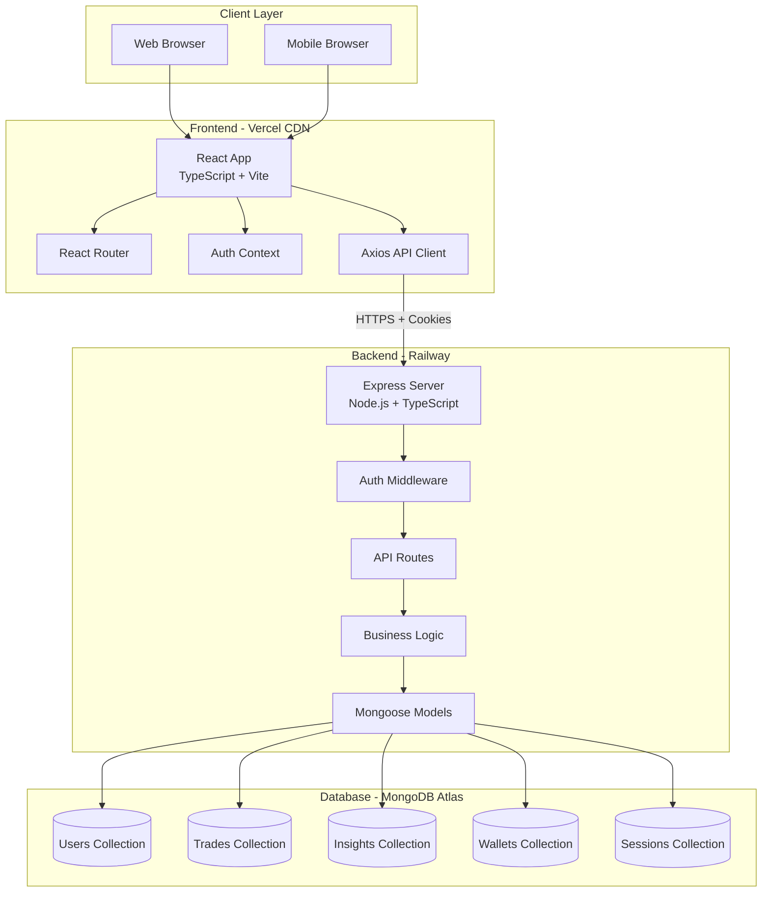

---

## 2. Request Flow Architecture

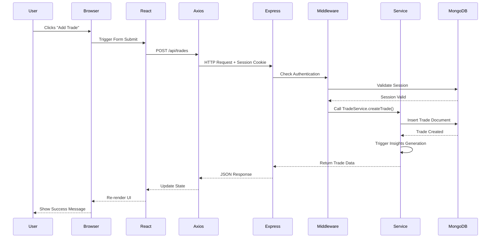

---

## 3. Authentication Flow

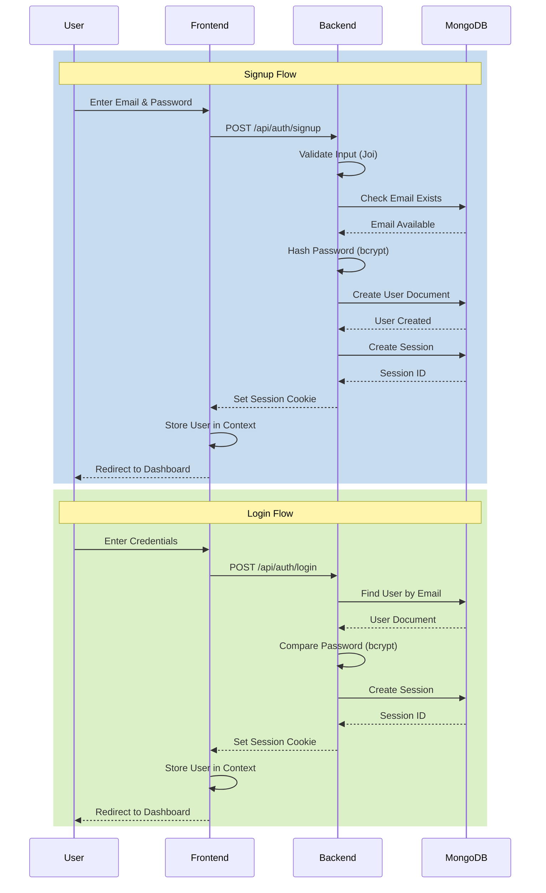

---

## 4. Database Schema Relationships

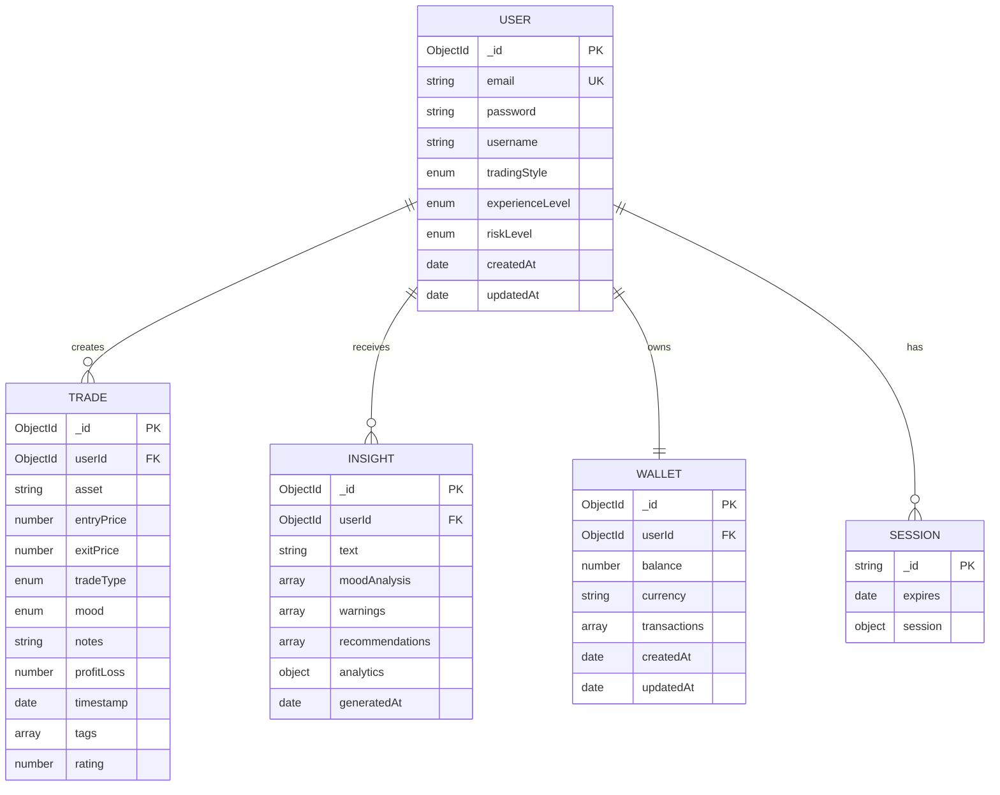

---

## 5. Backend Architecture Layers

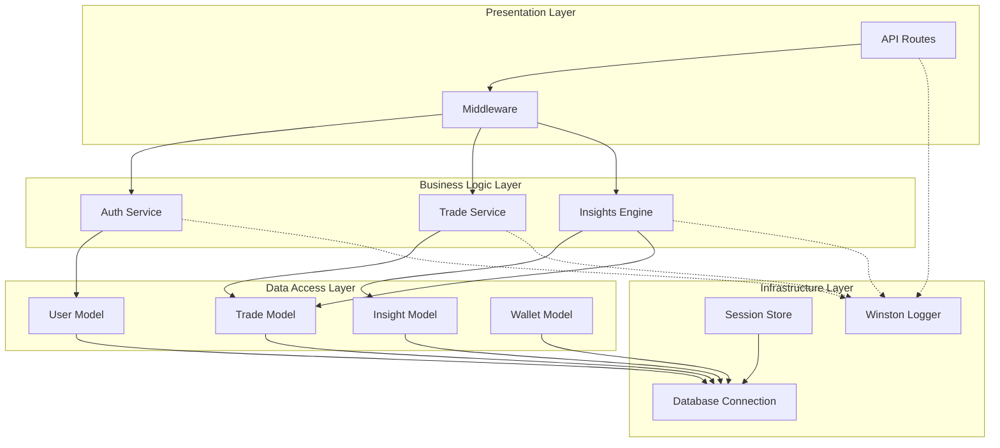

---

## 6. Frontend Component Architecture

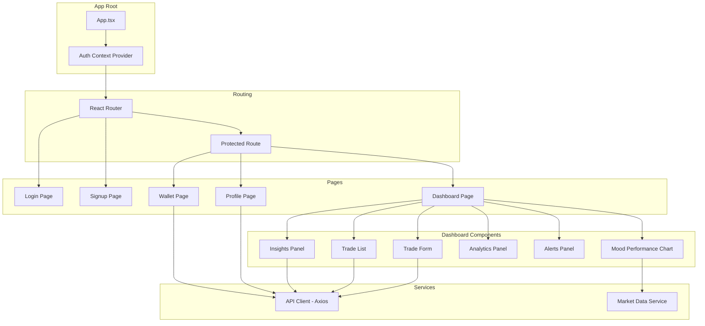

---

## 7. Deployment Architecture

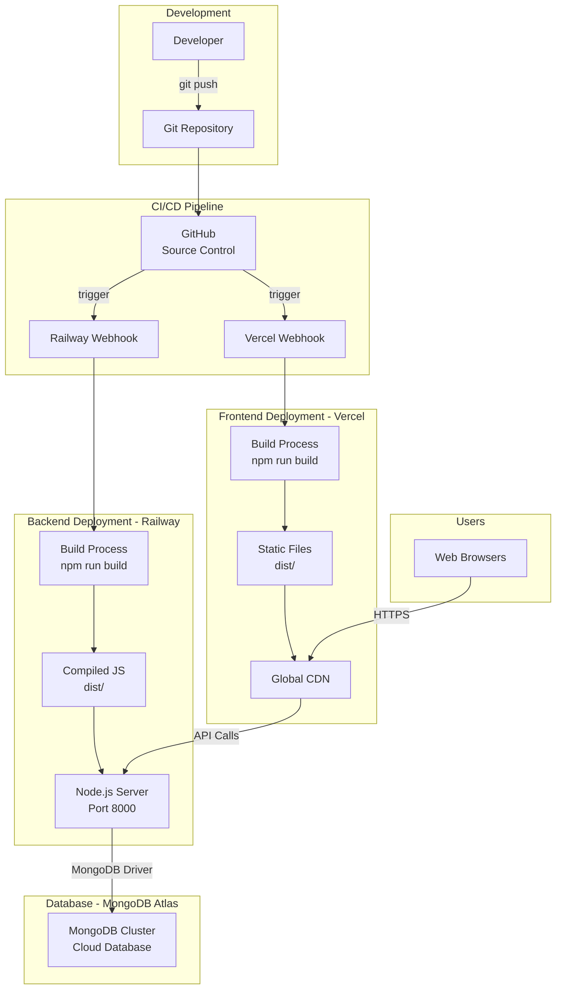

---

## 8. API Endpoint Structure

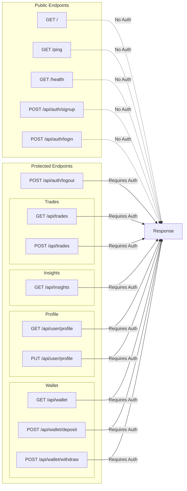

---

## 9. Session Management Flow

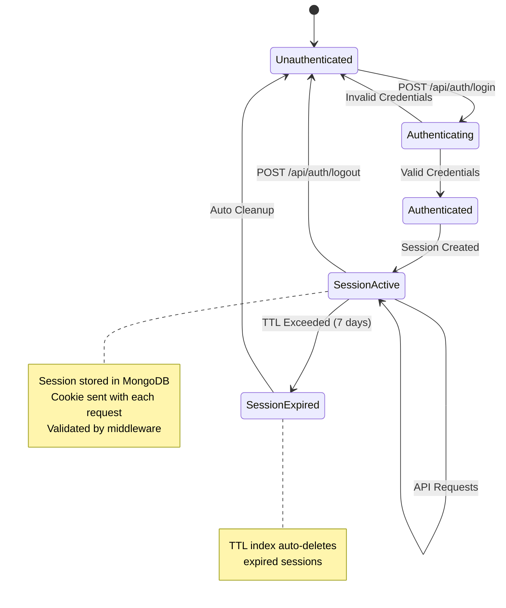

---

## 10. Insights Generation Algorithm

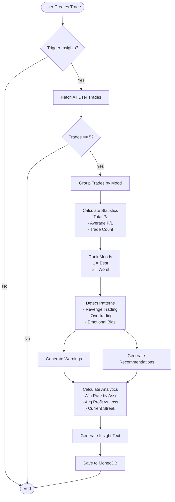

---

## 11. Error Handling Flow

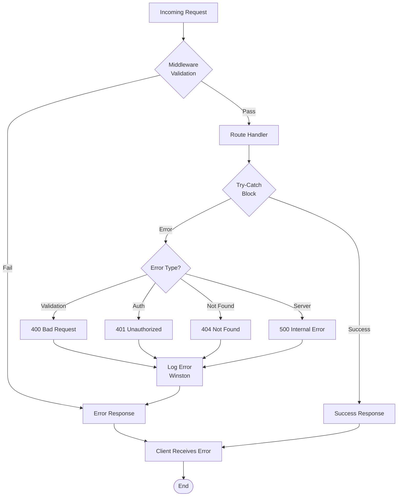

---

## 12. Data Flow: Creating a Trade

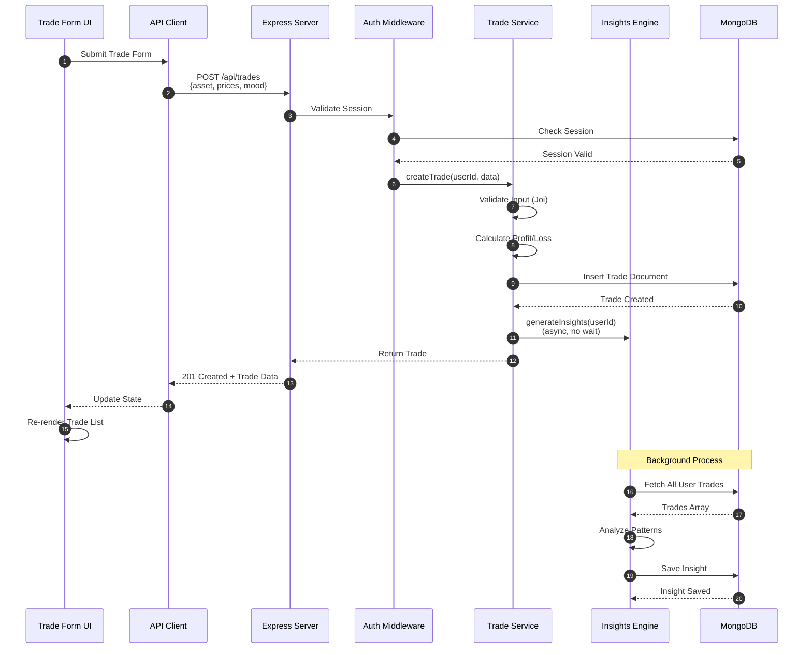

---

## 13. Security Architecture

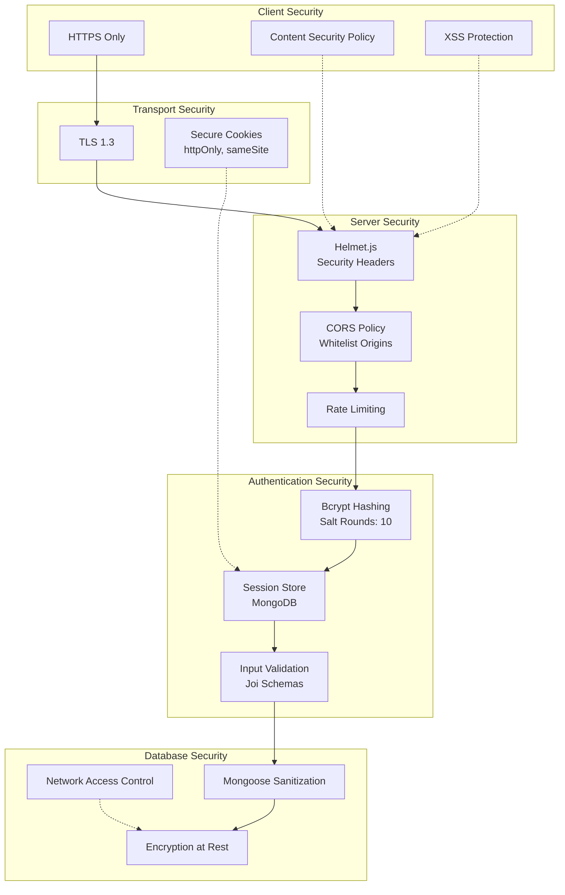

---

## 14. Scalability Architecture (Future)

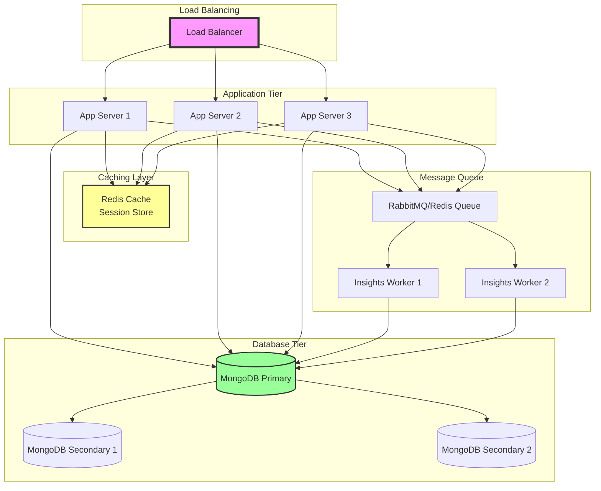

---

## How to View These Diagrams

### Option 1: GitHub (Automatic)
GitHub automatically renders Mermaid diagrams in markdown files. Just view this file on GitHub!

### Option 2: VS Code
Install the "Markdown Preview Mermaid Support" extension:
```
ext install bierner.markdown-mermaid
```

### Option 3: Online Viewer
Copy the Mermaid code and paste it into:
- https://mermaid.live/
- https://mermaid-js.github.io/mermaid-live-editor/

### Option 4: Documentation Sites
Use with documentation generators like:
- Docusaurus
- VuePress
- GitBook
- MkDocs

---

## Legend

- **Rectangles**: Processes/Components
- **Cylinders**: Databases
- **Diamonds**: Decision Points
- **Arrows**: Data Flow/Dependencies
- **Dotted Lines**: Optional/Async Operations
- **Subgraphs**: Logical Groupings

---

**Last Updated**: May 2, 2026
